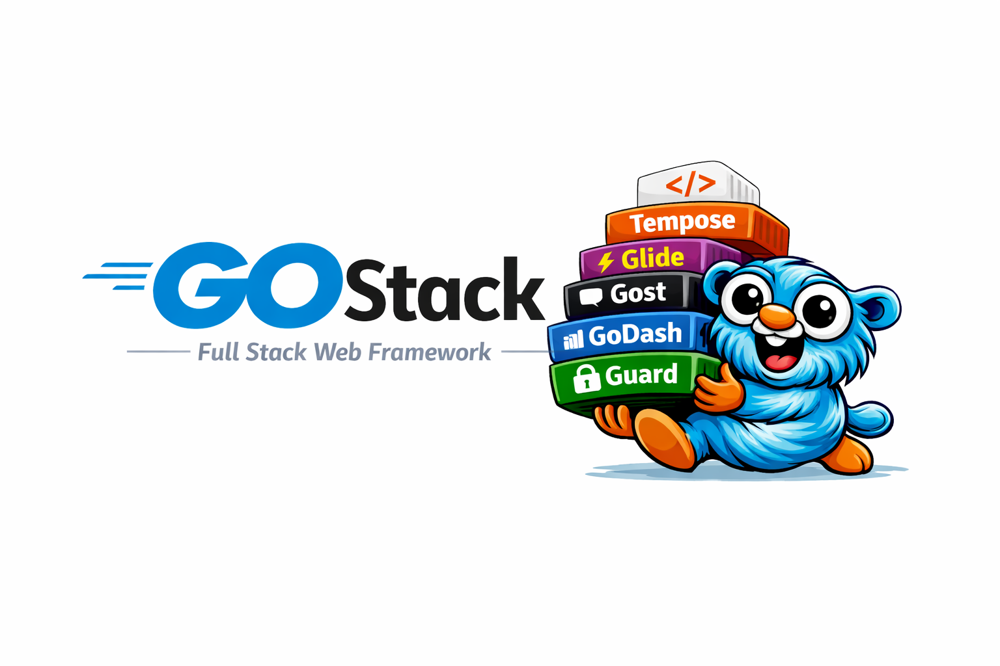

<!-- Logo -->
<p align="center">
  
</p>

<!-- Badges -->
<p align="center">
  
  
  
  
  
  
  
  
  <a href="https://pkg.go.dev/github.com/charledeon77/gostack-framework"></a>
  
</p>

<p align="center">
  <b>GoStack</b> — <i>A modern fullstack web framework for scalable web development in Go.</i>
</p>

# 📝 The Philosophy & Vision of GoStack  
## The Problem GoStack Solves  

Modern Web development in Go is fragmented by design. A typical Go Web project looks like:

1. **Router** from a third-party library (`gin` or `gorilla/mux`)
2. **ORM** from a third-party library (`gorm` or `ent`)
3. **Query Builder** from a third-party library (`sqlx` or `sqlc`)
4. **Migration tool** from a third-party library (`golang-migrate` or `goose`)
5. **Authentication system** from a third-party library (`authcore` or `goth`)
6. **Social authentication** from a third-party library (`golang.org/x/oauth2`)
7. **Background job queue** from a third-party library (`machinery` or `neoq`)
8. **Cron scheduler** from a third-party library (`robfig/cron`)
9. **Event dispatcher** from a third-party library (`EventBus`)
10. **WebSocket library** from a third-party library (`gorilla/websocket` or `coder/websocket`)
11. **File storage abstraction** from a third-party library (`aws-sdk-go` or `go-cloud`)
12. **Caching layer** from a third-party library (`go-redis`)
13. **Mail delivery** from a third-party library (`gomail`)
14. **CLI tooling** from a third-party library (`cobra`)
15. **Configuration management** from a third-party library (`viper`)

And that's just the backend. If you need a modern frontend:

16. **Frontend** built entirely separately (`React`, `Vue` or `Svelte`) in a different language, with its own build tools (`vite`/`webpack`), its own routing, its own state management, its own ecosystem — and its own 6 million package dependency hell.

**The result:** Sixteen third-party ecosystems. Sixteen mental models. Sixteen failure points — just to build one application.
**The GoStack Answer:** One Language. One Binary. One Mental Model.

#
# The Disruptive Paradigm Shift: GOSTACK

**GoStack** is the first complete end-to-end framework solution for building **FullStack Web applications** in Go. It handles:

01.) ✅ **Kernel Bootloader** *(Citadel)* — Unified service registration and framework orchestration boot system.
02.) ✅ **Service Container** *(Anchor)* — Fast, lock-shielded, thread-safe Dependency Injection & IoC container.
03.) ✅ **HTTP Router** *(Navigator)* — Ultra-fast, zero-allocation routing with automated path parameter binding.
04.) ✅ **Middleware Pipeline** *(Bridge)* — Onion-style middleware pipeline for request filtering and interception.
05.) ✅ **Query Builder & Hydrator** *(Crafter)* — Active Record query builder that hydrates database results into Go structs.
06.) ✅ **ORM Relationships** *(Conflex)* — Native resolver mapping HasOne, HasMany, and BelongsTo database relations.
07.) ✅ **Database Migrations** *(Traveller)* — Transaction-shielded, versioned database schema migration runner.
08.) ✅ **Schema Builder** *(Grapher)* — Fluent programmatic definition for columns, indexes, and constraints.
09.) ✅ **Authentication** *(Guard)* — Fully-baked session/token authentication with native CSRF protection.
10.) ✅ **In-Memory Cache** *(Mory)* — Generic-typed key-value caching layer with local and Redis memory adapters.
11.) ✅ **Background Queues** *(Sequence)* — Deferred job queue worker supporting delays, retries, and job chaining.
12.) ✅ **Event Dispatcher** *(Spark)* — Synchronous and asynchronous Pub/Sub event communication system.
13.) ✅ **SMTP HTML Mailer** *(GoMail)* — Rich HTML email formatting, template engines, and attachment delivery.
14.) ✅ **File Storage** *(Vault)* — Path-traversal secure storage engine supporting local and AWS S3 environments.
15.) ✅ **Notification Router** *(Alert)* — Decoupled, multi-channel alerting (Email, Database, SMS) dispatch engine.
16.) ✅ **Cron Task Scheduler** *(Planner)* — Native, in-app cron job scheduler replacing external system crontabs.
17.) ✅ **Social Logins** *(SocialHub)* — Plug-and-play OAuth2 login flow with Google, GitHub, and custom providers.
18.) ✅ **Admin Dashboard** *(GoDash)* — Auto-generated backoffice interface with real-time job and system monitors.
19.) ✅ **AOT UI Compiler** *(Tempose)* — Ahead-of-Time compiler translating HTML/CSS/JS components directly into Go source code.
20.) ✅ **Reactive Client Runtime** *(Glide)* — Zero-dependency DOM reactivity engine (Alpine/Svelte equivalent) running without Node.js.
21.) ✅ **CLI Assistant** *(Gost)* — Scaffolding runner for database models, migrations, and controller templates.
22.) ✅ **Driver Contracts** *(Contract)* — Interchangeable interface contracts decoupling framework drivers from core services.
23.) ✅ **Config Manager** *(GoCon)* — Clean, strongly-typed environment `.env` configuration file loader.
24.) ✅ **Request Validation** *(Validator)* — Declarative rule-based payload validation middleware for requests.
25.) ✅ **Real-Time WebSockets** *(GowSocket)* — Bi-directional, multi-group WebSocket communication hub.
26.) ✅ **Translation Engine** *(Transios)* — Localization manager supporting language dictionaries and formatting templates.
27.) ✅ **NoSQL MongoDB** *(GoMon)* — Active Record engine support mapping NoSQL document stores to Go models.
28.) ✅ **Graph Database** *(Nexus)* — Native Cypher query mapping and relation graph nodes for Neo4j database instances.
29.) ✅ **Wide-Column Cassandra** *(Aether)* — Distributed CQL query mapper and table optimizer for Apache Cassandra database structures.

---

### 📦 Official Extensions (Isolated Packages)
To respect core design rationale and keep database/architecture boundaries perfectly clean, complex plug-and-play extensions are managed in isolated packages:
*   🔑 **Multi-Factor Auth** *(MFA)* — RFC 6238 TOTP validation and QR code generation wrappers.
*   🛡️ **Role-Based Access Control** *(RBAC)* — Relational & NoSQL database-agnostic role permission middlewares and policy resolvers.

---

Everything in **One binary, One mental model, One language**.   

It's the equivalent of what **Laravel** gave **PHP**, what **Django** gave **Python**, and what **Rails** gave **Ruby** — instead of assembling an app from 10 independent packages, you get one coherent framework where every layer knows about every other layer by design.

**Go** developers have never had this — until now (June 2026).

# The Five (5) Core Pillars
## 1.) 🔋 Batteries Included:

**GoStack** ships with everything — routing, ORM, migrations, auth, caching, queues, WebSockets, scheduling, storage, events, admin dashboard, and a frontend compiler — all in one module, which means no abandonware risk, no integration hell, no context switching between Go and Node.js, no tracking ten different package versions, and no JavaScript frontend forced upon you, because everything is natively integrated, maintained as one coherent ecosystem, and compiled into a single binary, so you don't assemble a stack — you just build.

#
## 2.) 🔄 No Context Switching (Go-Native Fullstack)

The most radical part of GoStack: the frontend is Go. Components are `.html`, `.css`, and `.js` files that **Tempose** compiles into Go string literals at build time — no separate dev server, no proxy configuration, no CORS headaches.

**Client-side reactivity** is provided by **Glide**, a micro frontend engine inspired by Alpine.js, embedded directly in your binary. With Glide's `gs-*` directive system, you add interactivity using declarative attributes right in your HTML — `gs-click`, `gs-model`, `gs-show`, `gs-for`, and more. No `useState`, no `useEffect`, no virtual DOM, no build step. Just HTML with superpowers.

The result is a fullstack application with no Node.js, no `npm`, no `package.json`, no `node_modules`, no Webpack, no Vite, no Babel — just `go build`.   

**One language. One binary. No separate frontend toolchain**.

#
## 3.) 📘 Easy to Learn and Use (One Mental Model)

When you learn a new framework, you're not just learning syntax — you're learning a way of thinking. Most frameworks teach you ten different ways of thinking: one for data, one for background tasks, one for real-time updates, one for configuration. Every new feature demands a new mental context switch.

GoStack doesn't do this — everything in GoStack works the way you'd naturally expect it to work. The pattern you learn on day one is the same pattern you use every time forward. There are no hidden layers where the framework suddenly behaves differently because you've crossed some invisible complexity threshold.

With GoStack, there's just one simple pattern that never changes, no matter how big your idea gets.

#
## 4.) 🔒 Secure by Default

Most frameworks assume you'll remember to lock the door after you build the house. GoStack assumes you won't — so it locks every door for you, before you even lay the first brick.

With GoStack, security isn't an afterthought you scramble to add at the end of a project. It's baked into the foundation from the very first line. Every request is questioned. Every file access is contained. Every database query is protected unless you explicitly say otherwise. Every user action needs permission. Nothing is trusted by accident.

This means you can build with speed and sleep with peace of mind. Beginners don't have to become security experts just to launch their first app. Investors don't have to worry about the hidden cost of a breach. And developers don't have to spend their nights wondering if they forgot to sanitize that one input.

GoStack doesn't wait for you to make a mistake — it prevents the mistake from ever happening. Security isn't a feature you add later. It's how the framework works, baked in and always on.

## 5. ⚡ Developer Experience as a First-Class Feature

For years, developers in other ecosystems have enjoyed something Go never had: a complete, integrated framework where every piece works with every other piece out of the box. Rails has it. Django has it. Laravel has it.

Go developers have built amazing things too — but not because of the tooling. Despite it. Go developers have built amazing things too — but not because of the tooling. Despite it. Go developers have always had to build integration themselves, piece by piece, and then maintain it forever. A router here. An ORM there. A queue library over here. A WebSocket package somewhere else. Ten different ecosystems. Ten different futures. Ten chances for any one of them to fall out of sync with your needs.

GoStack delivers what Go has always deserved: a complete, integrated framework designed from the ground up to be **Future-Proof by Default**. No hunting for which router works with which ORM. No wondering if your WebSocket library will still be maintained next year. No constant context switching between packages with different philosophies.

The result is simple: one stack, one way of working, one future. No assembly required. No fragmentation. No guesswork.

Other ecosystems have enjoyed this foundation for years. GoStack brings it to the Go ecosystem, to finally remove those headaches and uncertainties.

GoStack handles the heavy lifting and the behind-the-scenes complexity. While you handle your ambition and concentrate on your core business objectives.

# The Core Rationale in One Sentence
GoStack exists because Go is an exceptional language held back by ecosystem fragmentation — and the cure is a single, opinionated, compile-safe framework that lets you build the server, the database layer, and the UI without ever leaving Go.

It's positioned as the answer to: "Why would I use Laravel/Rails/Django if I want Go's performance?" The answer GoStack gives is: "You wouldn't have to choose anymore."


---

## ⚡ The Death of "Glue Code" (15 Packages vs. The GoStack Way)

If you ask how to build a complete fullstack application in Go using standard open-source libraries, you are usually handed a fragmented stack of 15+ independent packages. 

Instead of writing your product, you spend the first week writing "glue code" to make these libraries talk to each other, dealing with dependency version conflicts, and managing complex configurations.

Here is how **GoStack** consolidates the entire fullstack developer experience:

| Feature Capability | The Fragmented Way (15 Libraries) | The GoStack Way (Unified Built-ins) |
| :--- | :--- | :--- |
| **HTTP Routing** | `gin-gonic/gin` or `chi` | **Navigator** — Built-in, high-performance router |
| **Database ORM** | `gorm.io/gorm` | **Crafter** & **Conflex** — Active Record & Hydrator |
| **Migrations** | `pressly/goose` or `golang-migrate` | **Traveller** — Database version schema runner |
| **UI Templates** | `a-h/templ` | **Tempose** — AOT component compiler |
| **Session Auth** | `authcore` or custom cookie sessions | **Guard** — Session & Token Auth + CSRF protection |
| **Social Login** | `golang.org/x/oauth2` | **SocialHub** — Multi-provider OAuth login flow |
| **Job Queue** | `neoq` or `asynq` | **Sequence** — Delayed background worker queues |
| **Cron Scheduling** | `robfig/cron/v3` | **Planner** — Background task scheduler |
| **Event Dispatcher** | `EventBus` | **Spark** — Pub/Sub event dispatcher |
| **WebSockets** | `coder/websocket` | **GowSocket** — Bi-directional WebSocket hub |
| **File Storage** | `gocloud.dev` (blob) | **Vault** — Local & AWS S3 secure storage sandbox |
| **Caching / Cache** | `go-redis/v9` | **Mory** — Generic-typed key-value memory cache |
| **SMTP Mailing** | `gomail` | **GoMail** — SMTP HTML mailer |
| **CLI App Runner** | `spf13/cobra` | **Gost** — Interactive console command assistant |
| **Config Loader** | `spf13/viper` | **GoCon** — Dynamic `.env` environment parser |
| **User Alerting** | Custom mail & DB notification logic | **Alert** — Multi-channel notification router |

By consolidating these 16 libraries into **one binary, one programming language, and one cohesive mental model**, GoStack frees you from configuration hell. **Zero glue code. Zero package conflicts. Just pure product engineering.**

---

## 🗺️ The GoStack Subsystem Registry

Every major capability in GoStack is a fully tested, co-developed, and branded subsystem:

| Branded Name | Subsystem Capability | Description |
| :--- | :--- | :--- |
| **Citadel** | Application Bootloader & Unified Kernel | Coordinates GoStack's application lifecycle by executing registration and boot phases across all modules. It guarantees that critical resources (like database pools and routers) are fully initialized before the framework starts serving requests. |
| **Anchor** | IoC Service Container & Dependency Injection | A thread-safe, lock-shielded Inversion of Control storage container. By resolving service blueprints on demand, it completely eliminates dependency-ordering bugs and compile-time code generation bloat. |
| **Navigator** | HTTP Router | A high-performance, parameter-binding HTTP routing tree. It parses URL patterns, matches incoming paths, and passes request scopes directly to target handlers with zero dynamic runtime allocations. |
| **Bridge** | Middleware Pipeline (Onion Architecture) | Implements a sequential onion-style middleware pipeline. It intercepts requests to perform cross-cutting tasks (like CSRF protection, CORS handling, or sessions) before letting target handlers execute, supporting early-exit abort flows. |
| **Crafter** | Query Builder & Reflective Hydrator | Dynamically generates clean, optimized SQL and database calls. It utilizes a runtime reflection cache to safely translate raw database records into strongly-typed Go entities, shielding developer code from raw SQL boilerplate. |
| **Conflex** | ORM Relationship Mapper | Resolves relational model schemas (`HasOne`, `HasMany`, `BelongsTo`). It tracks and loads child connections, caching retrieved structures to eliminate costly N+1 query execution bottlenecks. |
| **Traveller** | Database Migration Engine | Performs transaction-shielded, versioned database schema updates. It maps applied migrations inside system ledgers to keep local development environments and production servers perfectly in sync. |
| **Grapher** | Schema Builder (fluent column definitions) | Provides a fluent, programmatic builder interface for setting up database columns, indexes, and constraints. It translates Go definitions into native DDL statements, avoiding raw schema script errors. |
| **Guard** | Authentication (session-based) | Manages secure user session cookies, token issuance, and CSRF token generation. It acts as the secure entry guard, shielding internal routes from unauthenticated actors. |
| **Mory** | Generic-typed In-Memory Cache | A high-speed, generic-typed key-value caching layer. It stores heavily accessed data models in local memory to speed up response times and reduce database querying overhead. |
| **Sequence** | Background Job Queue | Manages background queue workers to run deferred tasks (like report compiles or API calls). It supports retries, custom delays, and job chains, ensuring the main HTTP request thread remains fast. |
| **Spark** | Pub/Sub Event Dispatcher | Dispatches synchronous and asynchronous events across application modules. It allows developers to completely decouple actions (e.g. "UserRegistered") from side-effects (e.g. "SendWelcomeEmail"). |
| **GoMail** | SMTP Mailer | A zero-dependency SMTP client built on standard Go packages. It handles HTML mail formatting, attachment rendering, and template loading, enabling professional email delivery. |
| **Vault** | File Storage (Local + S3) | Provides a secure, path-traversal shielded file storage gateway. It allows developers to swap local folder storage for cloud storage (like AWS S3) transparently by modifying a single environment variable. |
| **Alert** | Multi-Channel Notification System | Routes notifications across multiple delivery channels (Email, Database, SMS). It decouples notification messages from delivery platforms using a unified, fluent dispatcher structure. |
| **Planner** | Cron Task Scheduler | A background schedule scheduler that runs cron-style tasks. It eliminates the need for external system-level crontabs, letting developers configure recurrent jobs inside compile-safe Go code. |
| **SocialHub** | OAuth Social Login | Handles third-party OAuth2 authorization flows (like Google or GitHub). It validates secure callbacks, retrieves user profile metadata, and integrates credentials with the Guard subsystem. |
| **GoDash** | Admin Panel & Sequence Monitor | Provides an auto-generated admin interface and background queue monitoring screen. It allows developers to visualize active tasks, search database records, and debug jobs out of the box. |
| **Tempose** | AOT UI Component Compiler | Compiles HTML component templates, styles, and scripts into static Go code. It completely eliminates disk IO overhead at runtime, allowing templates to render at Go's compiled speed. |
| **Glide** | Client-Side Reactive Runtime | A zero-dependency reactive directive engine served directly inside page bundles. It parses dynamic HTML attributes (like `gs-model`, `gs-show`) to manage reactivity, spa router morphs, and transitions without Node.js toolchains. |
| **Gost** | CLI Command Runner | Powers the command-line interface. It registers custom console scripts, executes database migration scripts, and generates scaffolded components using Go's exact dependency tree. |
| **Contract** | Interface Definitions (driver contracts) | Defines the core interface contracts that decouple framework drivers from your application logic. It ensures that system implementations (like cache backends) remain fully interchangeable. |
| **GoCon** | Environment Config Manager (`.env` parser) | Scans, parses, and loads `.env` variables into application state at boot time. It converts configuration keys into strongly-typed structures, protecting startup routines from missing keys. |
| **Validator** | Request Validation Engine | Evaluates incoming request JSON payloads or form data against declared rules. It acts as the gateway validation layer, mapping error details onto contexts before reaching controller logic. |
| **GowSocket** | Real-Time WebSocket Hub | Orchestrates bi-directional, persistent WebSocket client connections. It manages socket groups, processes message frames, and runs real-time pushes with native Go channels. |
| **Transios** | Localization & Translation Engine | Dynamically formats dates, currencies, and localized strings based on user languages. It reads translation directories at boot time, mapping language templates for client renderers. |
| **GoMon** | MongoDB Integration (NoSQL Document Store) | Provides native NoSQL document store mappings. It extends Crafter's hydration engine to parse BSON objects, enabling schema-less database operations alongside relational models. |
| **Nexus** | Neo4j Graph Database Integration | Bridges GoStack with Neo4j graph nodes. It supports execution of Cypher query patterns, mapping complex relational graphs onto Go models. |
| **Aether** | Cassandra Wide-Column Database Integration | Cassandra Wide-Column Database Integration. It optimizes CQL queries and handles massive, distributed tables, mapping wide-column records into structured entities. |

---

## 📦 Official Extensions

GoStack supports optional plug-and-play extensions that are fully isolated from the core framework package to maintain clean database and architecture boundaries:

*   **MFA (TOTP Multi-Factor Authentication):** Standard RFC 6238 TOTP verification and QR code generation.
    ```bash
    go get github.com/charledeon77/gostack-extensions/mfa
    ```
*   **RBAC (Role-Based Access Control):** Dynamic roles, permissions, HTTP middlewares, and database-agnostic resolvers (supporting both relational SQL databases and NoSQL/Cassandra).
    ```bash
    go get github.com/charledeon77/gostack-extensions/rbac
    ```

---

## ✨ The GoStack Architectural Manifesto & Developer Joy Guidelines

GoStack was designed with a simple belief: **building web apps should feel like play, not puzzle assembly.** These principles ensure GoStack remains the most enjoyable, robust, and lightning-fast fullstack environment in the Go ecosystem.

### 🚀 1. The Zero-Dependency Principle (Compile in under 2 Seconds)
*   **The Rationale:** GoStack avoids the library creep that slows down projects. By writing native, optimized standard library wrappers instead of importing heavy third-party packages, we preserve Go's famous compilation speeds.
*   **The Developer Joy:** Your entire app compiles in the blink of an eye. You get tiny, single-file distribution binaries with zero runtime dependencies.
*   **The Guideline:** Before running `go get` for a utility, try standard library primitives first. Keep the codebase clean, lean, and self-contained.

### 🎨 2. No Node.js. No npm. No Webpack. (Tempose AOT Compilation)
*   **The Rationale:** Frontend templates (HTML, CSS, JS) compile directly into Go code by **Tempose** during your build. 
*   **The Developer Joy:** You get a fullstack app with no `node_modules` bloating your drive, no Webpack configuration files to debug, and no separate Node.js dev server. Just raw, lightning-fast Go runtime rendering.
*   **The Guideline:** Run `gostack compile` (or launch `gost dev` for real-time hot-reloading) to let the AOT compiler build your frontend assets directly into the Go source files.

### 🧩 3. Write Once, Run Anywhere (The Context & Contract Design)
*   **The Rationale:** Dynamic application operations use **Contract** interfaces (`framework/contract`), meaning they never bind directly to a specific backend database or driver.
*   **The Developer Joy:** Need to switch from local disk storage to AWS S3? Or from SQLite to PostgreSQL? Just change a line in your `.env`. The codebase remains untouched and fully operational.
*   **The Guideline:** Always accept contract interfaces in your services rather than concrete structs. Let the container handle the bindings.

### ⚡ 4. Streamlined HTTP Operations (The Context Wrapper Pattern)
*   **The Rationale:** Middleware, controllers, and interceptors share a unified `*http.Context` wrapper instead of raw primitives.
*   **The Developer Joy:** Retrieving path params, validating JSON inputs, rendering templates, or setting secure cookies becomes a single, clean method call. No redundant boilerplate code.
*   **The Guideline:** Utilize the context helpers to pass payload states cleanly through the **Bridge** onion middleware pipeline.

### 🎨 5. Style Freedom by Default (`gs-css`)
*   **The Rationale:** Tempose's baseline default styling engine only acts on HTML elements that explicitly carry the `gs-css` tag attribute.
*   **The Developer Joy:** The framework never hijacks your custom layouts or overrides your Tailwind/Vanilla CSS rules. You stay in full creative control of your design system from day one.
*   **The Guideline:** Include `gs-css` on components where you want GoStack's built-in styles, and leave it off where you want absolute creative freedom.

---
*GoStack — The performance of Go, the speed of Laravel, the simplicity of Alpine. One binary. One language. Zero headaches.*
